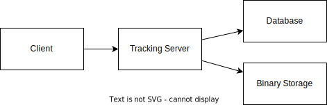

# MLFlow Server

Example project to show how to run an MLFlow tracking server and artifact store.



```bash
# Setup virtual environment and install dependencies
./script/setup.sh

# Start Dependencies
docker compose up -d

# Start MLFlow server
./script/start.sh
```

Configure systemd file `/etc/systemd/system/mlflow.service` to start the MLFlow server on boot.

```bash
sudo cp ./mlflow.service /etc/systemd/system/mlflow.service

# Start the service
sudo systemctl daemon-reload
sudo systemctl start mlflow
sudo systemctl enable mlflow

# Check the status
sudo systemctl start mlflow
sudo systemctl stop mlflow
sudo systemctl restart mlflow
sudo systemctl status mlflow
journalctl -u mlflow
```

# Development

You'll need to set up a development environment if you want to develop a new feature or fix issues. The project uses a docker based devcontainer to ensure a consistent development environment.

- Open the project in VSCode and it will prompt you to open the project in a devcontainer. This will have all the required tools installed and configured.

## Setup local dev environment

If you use the devcontainer image you need to log into the Container registry

```bash
# load .env vars (optional)
[ -f .env ] && while IFS= read -r line; do [[ $line =~ ^[^#]*= ]] && eval "export $line"; done < .env

az login --use-device-code --tenant "$AZURE_TENANT_ID"
az acr login --name $REGISTRY_LOGIN_SERVER --username $TOKEN_NAME --password $TOKEN_PWD
docker login -u $TOKEN_NAME -p $TOKEN_PWD  $REGISTRY_LOGIN_SERVER
echo $TOKEN_PWD | docker login --username $TOKEN_NAME --password-stdin $REGISTRY_LOGIN_SERVER
```

If you want to develop outside of a docker devcontainer you can use the following commands to setup your environment.

```bash
# Configure the environment variables. Copy example.env to .env and update the values
cp example.env .env

# load .env vars
# [ ! -f .env ] || export $(grep -v '^#' .env | xargs)
# or this version allows variable substitution and quoted long values
# [ -f .env ] && while IFS= read -r line; do [[ $line =~ ^[^#]*= ]] && eval "export $line"; done < .env

# Create and activate a python virtual environment
# Windows
# virtualenv \path\to\.venv -p path\to\specific_version_python.exe
# C:\Users\!Admin\AppData\Local\Programs\Python\Python312\python.exe -m venv .venv
# .venv\scripts\activate

# Linux
# virtualenv .venv /usr/local/bin/python3.12
# python3.12 -m venv .venv
# python3 -m venv .venv
python3 -m venv .venv
source .venv/bin/activate

# Update pip
python -m pip install --upgrade pip

# Install dependencies
pip install -r requirements_dev.txt

# Configure linting and formatting tools
sudo apt-get update
sudo apt-get install -y shellcheck
pre-commit install
```

## Style Guidelines

This project enforces quite strict [PEP8](https://www.python.org/dev/peps/pep-0008/) and [PEP257 (Docstring Conventions)](https://www.python.org/dev/peps/pep-0257/) compliance on all code submitted.

We use [Black](https://github.com/psf/black) for uncompromised code formatting.

Summary of the most relevant points:

- Comments should be full sentences and end with a period.
- [Imports](https://www.python.org/dev/peps/pep-0008/#imports) should be ordered.
- Constants and the content of lists and dictionaries should be in alphabetical order.
- It is advisable to adjust IDE or editor settings to match those requirements.

### Use new style string formatting

Prefer [`f-strings`](https://docs.python.org/3/reference/lexical_analysis.html#f-strings) over `%` or `str.format`.

```python
# New
f"{some_value} {some_other_value}"
# Old, wrong
"{} {}".format("New", "style")
"%s %s" % ("Old", "style")
```

One exception is for logging which uses the percentage formatting. This is to avoid formatting the log message when it is suppressed.

```python
_LOGGER.info("Can't connect to the webservice %s at %s", string1, string2)
```

### Testing

Ideally, all code is checked to verify the following:

All the unit tests pass All code passes the checks from the linting tools To run the linters, run the following commands:

```bash
# Use pre-commit scripts to run all linting
pre-commit run --all-files

# Run a specific linter via pre-commit
pre-commit run --all-files codespell

# Run linters outside of pre-commit
codespell .
shellcheck -x ./script/*.sh
```

# Deployment

The project uses GitHub Actions to deploy the application.

## Build Docker Image
```bash
# Build image
model_name="dev.mlflow-sample-model-test_script"
model_version="4"
image="${model_name}_v${model_version}"
image_version="2024.7.1.dev20240723T1400"
artifact_path="./artifacts/iris_model"

./script/devops.sh build_image --name "$image" --version "$image_version" --artifact_path "$artifact_path"

# Run container
image_name="${image}:${image_version}"
docker run -p 5000:5000 "$image_name"
# Get container ID
container_id=$(docker ps -q --filter ancestor="$image_name")

docker stop $(docker ps -q --filter ancestor="$image_name")

```

# Tracking Server

Login to the tracking server `http://<TRACKING_SERVER_IP>:5000`


```bash
# SSH into the Tracking Server
ssh -i ~/.ssh/id_rsa azureuser@$TRACKING_SERVER_IP
```
