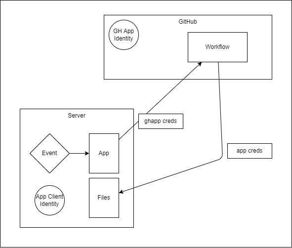

# GitHub App
Example GitHub App that can trigger a workflow in a repository.

## Details

* Workflows can be triggered using
    * Externally with [`repository_dispatch` event](https://docs.github.com/en/actions/using-workflows/events-that-trigger-workflows#repository_dispatch).
        * [Create a repository dispatch event](https://docs.github.com/en/rest/repos/repos?apiVersion=2022-11-28#create-a-repository-dispatch-event) by calling the `repos/{owner}/{repo}/dispatches` API endpoint
        * The `repos/{owner}/{repo}/dispatches` API endpoint
            * works with [GitHub App installation access tokens](https://docs.github.com/en/apps/creating-github-apps/authenticating-with-a-github-app/generating-an-installation-access-token-for-a-github-app)
            * and requires [`Contents` repository permissions (write)](https://docs.github.com/en/rest/authentication/permissions-required-for-github-apps?apiVersion=2022-11-28#repository-permissions-for-contents)
        * To make an API request as an app installation,
            * [Generate an installation access token](https://docs.github.com/en/apps/creating-github-apps/authenticating-with-a-github-app/authenticating-as-a-github-app-installation#generating-an-installation-access-token)
                * you must have a [private key and the ID](https://docs.github.com/en/apps/creating-github-apps/authenticating-with-a-github-app/managing-private-keys-for-github-apps) of your GitHub App to generate an access token
            * Send the installation access token in the Authorization header of the API requests.
    * Manually with [`workflow_dispatch` event](https://docs.github.com/en/rest/actions/workflows?apiVersion=2022-11-28#create-a-workflow-dispatch-event)
* Use the [MLFlow REST API](https://mlflow.org/docs/latest/rest-api.html) to download artifacts
* [Create Models from assets](https://learn.microsoft.com/en-us/azure/machine-learning/how-to-manage-models-mlflow?view=azureml-api-2#creating-models-from-assets) in Azure Machine Learning

## Steps

* Configure a GitHub App
    * Create GitHub App
    * Provide `Contents` repository permissions (write)
    * [Install the GitHub App](https://docs.github.com/en/apps/using-github-apps/installing-your-own-github-app) for a repository
    * [Generate a private key](https://docs.github.com/en/apps/creating-github-apps/authenticating-with-a-github-app/managing-private-keys-for-github-apps) and the ID of your GitHub App
* Call the REST endpoint as the GitHub App
    * [Generate a JSON Web Token (JWT) for the GitHub App](https://docs.github.com/en/apps/creating-github-apps/authenticating-with-a-github-app/generating-a-json-web-token-jwt-for-a-github-app)
    * [Get the GitHub App Installation ID](https://docs.github.com/en/rest/apps/apps?apiVersion=2022-11-28#list-installations-for-the-authenticated-app)
    * [Get an installation `access_token` for the GitHubApp](https://docs.github.com/en/rest/apps/apps?apiVersion=2022-11-28#create-an-installation-access-token-for-an-app)
    * Use the `access_token` to make API requests to trigger a workflow in a repository

# References
* https://docs.github.com/en/apps/creating-github-apps/authenticating-with-a-github-app/making-authenticated-api-requests-with-a-github-app-in-a-github-actions-workflow
* About authentication with a GitHub App https://docs.github.com/en/apps/creating-github-apps/authenticating-with-a-github-app/about-authentication-with-a-github-app
